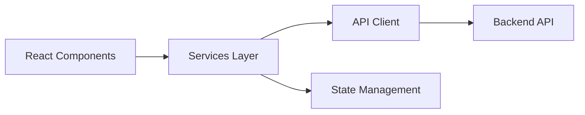
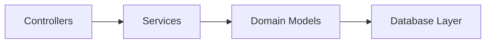
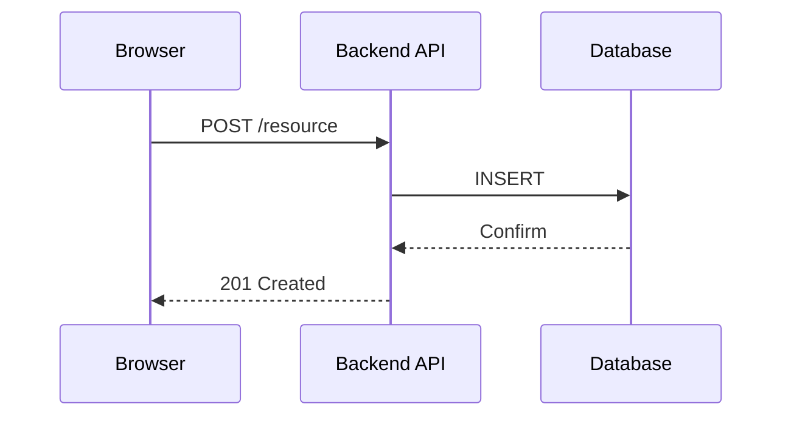
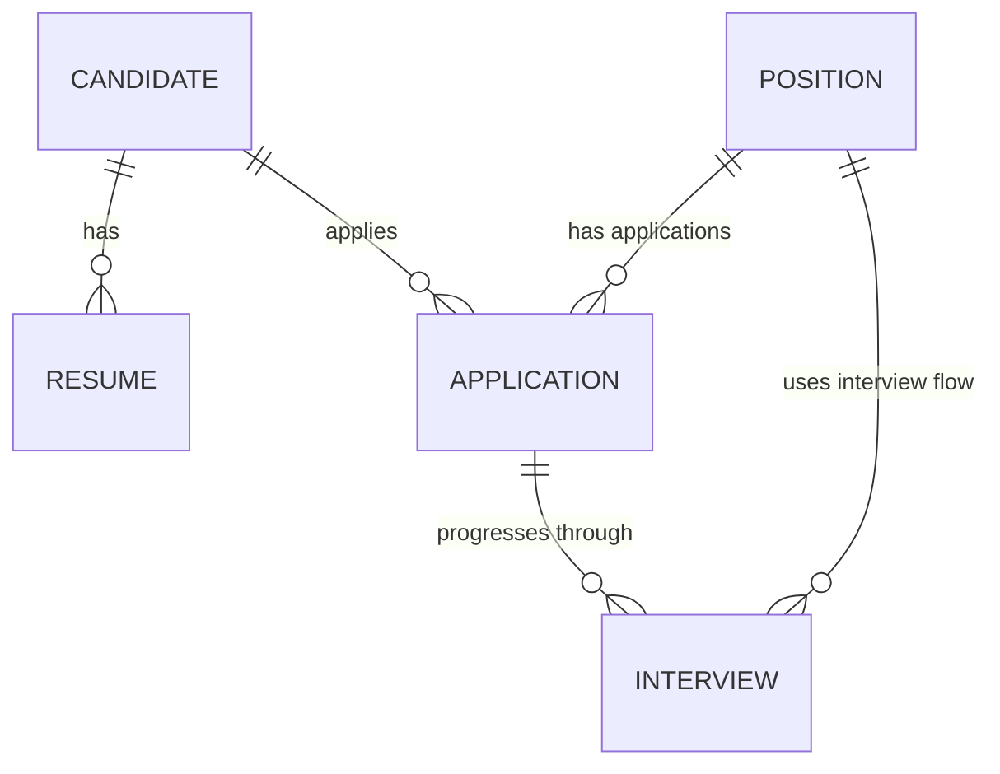

# Source Project Documentation Skill

## Purpose

Automatically analyze a source project and generate comprehensive technical documentation with Mermaid diagrams, eliminating manual documentation overhead and ensuring documentation stays in sync with code.

**Output**: Production-ready markdown documentation (5-8 files) with:
- Project overview and architecture
- Technology stack with version detection
- Database ER diagram (if applicable)
- Frontend/Backend architecture diagrams
- Key features and cross-cutting concerns
- Deployment and development guide

## When to Use This Skill

✅ **Use this skill when you need to:**
- Document an unfamiliar codebase for team onboarding
- Generate architecture diagrams from source code (avoid manual Visio/Lucidchart)
- Create ER diagrams from database schema files
- Map technology stack and dependencies
- Understand project structure and entry points quickly
- Build a knowledge base for future developers
- Generate living documentation that reflects current code state

❌ **Don't use this skill for:**
- API documentation (use OpenAPI/Swagger instead)
- User-facing feature documentation
- Business requirements documentation
- Tutorial or guide writing

## How It Works

### Step 1: Project Analysis

The skill automatically detects the project type and technology stack by inspecting:

**Frontend Detection Signals**:
- `package.json` with `react`, `vue`, `angular`, `next`, `svelte` dependencies
- `tsconfig.json` + `src/components/` (React)
- `webpack.config.js`, `vite.config.js`, `next.config.js`
- `.html` or `.jsx/.tsx` files in root or `src/`

**Backend Detection Signals**:
- `package.json` with `express`, `fastify`, `nest`, `apollo` OR
- `requirements.txt` with `django`, `flask`, `fastapi` OR
- `go.mod`, `build.gradle`, `pom.xml`
- `src/routes/`, `src/services/`, `src/controllers/` directories
- Database connection strings in `.env` or config files

**Database Detection Signals**:
- `schema.prisma`, `migrations/`, SQL files in `db/` or `database/`
- `docker-compose.yml` with `postgres`, `mysql`, `mongodb`
- `.env` with `DATABASE_URL`

**Infrastructure/DevOps Signals**:
- `docker-compose.yml`, `Dockerfile`
- `kubernetes/`, `helm/` directories
- `.github/workflows/`, `.gitlab-ci.yml`
- `terraform/`, `infrastructure/` directories

### Step 2: Documentation Generation

For each detected component, the skill generates mandatory sections:

#### Project Overview
- 1-2 sentence description (from `package.json` description or README.md)
- Key characteristics (e.g., "Frontend-only SPA", "Full-stack monolith", "Microservices")
- Tech stack summary (e.g., "React 18 + Express.js + PostgreSQL")
- Live demo or repo link (if found)

#### Technology Stack
| Layer | Technology | Version | Purpose |
|-------|-----------|---------|---------|
| Frontend | React | 18.2.0 | UI framework |
| Backend | Express.js | 4.18.0 | REST API |
| Database | PostgreSQL | 14 | Data persistence |
| ORM | Prisma | 5.0.0 | Database access layer |

Version detection from:
- `package.json` or `requirements.txt` for dependencies
- `Dockerfile FROM` for language/runtime version
- Database version from docker-compose.yml or schema comments

#### Architecture Overview

**Frontend Architecture** (if frontend detected):


**Backend Architecture** (if backend detected):


**Data Flow** (if both frontend and backend):


#### Database Schema (if applicable)



Generated from:
- Prisma schema.prisma
- SQL migration files
- TypeORM entity files
- Django models
- Raw SQL DDL

#### Frontend Documentation (if React/Vue/Angular detected)

**Component Structure**:
- Directories: `src/components/`, `src/pages/`, `src/layouts/`
- Key components identified: Forms, Tables, Navigation, Modal dialogs
- Component dependencies mapped

**State Management**:
- Redux store structure (if Redux detected)
- Context API usage (if React Context detected)
- Local component state patterns

**Styling Approach**:
- Bootstrap 5, Tailwind CSS, styled-components, or CSS Modules
- Global CSS variables or theme tokens
- Responsive breakpoints documented

**Key Features**:
1. User authentication and authorization
2. Data forms and validation
3. Real-time notifications
4. File upload handling
5. Search and filtering
6. Responsive design for mobile/tablet

#### Backend Documentation (if Node/Python/Java detected)

**Request Flow**:
- Entry point (Express app, Django views, Spring controllers)
- Middleware stack (CORS, logging, auth, error handling)
- Route definitions and grouping
- Controller → Service → Repository pattern

**Key Features**:
1. Authentication (JWT, OAuth, session-based)
2. Authorization and role-based access control
3. Data validation and error handling
4. File upload and storage
5. Background jobs or task queues
6. Caching strategy

**API Endpoints** (if available):
- POST /candidates - Create candidate
- GET /candidates/:id - Retrieve candidate
- Error response codes (400, 401, 403, 404, 500)

#### Cross-Cutting Concerns

**Security**:
- Authentication method (JWT token, OAuth, session)
- Authorization pattern (role-based, permission-based)
- Secrets management (.env, vault, secrets manager)
- HTTPS/TLS enforcement
- CORS policy

**Observability**:
- Logging framework and log levels
- Metrics collection (Prometheus, StatsD, CloudWatch)
- Distributed tracing (if microservices)
- Monitoring dashboards (Grafana, DataDog)

**Error Handling**:
- Global error handling middleware
- Error codes and messages
- User-friendly vs. technical errors
- Error logging and alerting

**Performance**:
- Caching strategy (Redis, in-memory, HTTP cache headers)
- Database indexing strategy
- Code splitting and lazy loading (frontend)
- CDN usage for static assets

#### Development & Deployment

**Local Development Setup**:
```bash
# Install dependencies
npm install

# Database setup
npm run db:migrate

# Start development server
npm run dev
```

**Build and Production**:
```bash
npm run build
npm run start:prod
```

**Deployment Target**:
- Docker containerization (if Dockerfile exists)
- Cloud platform (AWS, GCP, Azure, Heroku)
- CI/CD pipeline (.github/workflows, GitLab CI)

## Output Structure

```
/documentation/
├── README.md (overview + quick start)
├── ARCHITECTURE.md (system design + diagrams)
├── TECH_STACK.md (detailed technology choices)
├── DATABASE.md (schema + ER diagram)
├── FRONTEND.md (component structure + features)
├── BACKEND.md (API design + services)
├── DEPLOYMENT.md (build + production setup)
└── TROUBLESHOOTING.md (common issues + debugging)
```

Each file is cross-linked with references to others.

## Quality Checklist

### Must Have (every project)
- [ ] Project overview (1-2 sentences)
- [ ] Technology stack table with versions
- [ ] Architecture overview diagram (Mermaid flowchart)
- [ ] Key features list (5+ features)
- [ ] Local development quick start (copy-paste commands)
- [ ] Build and deployment steps

### Should Have (if applicable)
- [ ] Database ER diagram (if database present)
- [ ] Frontend architecture (if frontend present)
- [ ] Backend service architecture (if backend present)
- [ ] API endpoint list (if backend REST API)
- [ ] Security and observability sections
- [ ] Troubleshooting guide with common issues

### Nice to Have
- [ ] Deployment architecture diagram
- [ ] Performance optimization notes
- [ ] Contributing guidelines
- [ ] Glossary of domain terms

## Validation Script

```bash
cd .claude/skills/source-project-documentation
python3 scripts/validate_docs.py /path/to/project --output /path/to/generated/docs
```

Checks:
- All mandatory sections present
- Diagrams are valid Mermaid syntax
- Code examples are executable
- Links between docs are correct
- No broken references

## Examples

### Example 1: Frontend-Only Project (React SPA)

**Input**: `/frontend` directory with React + TypeScript + Bootstrap

**Detection**: React 18, TypeScript, Bootstrap 5, no backend

**Output**:
- README.md - Overview, quick start (npm start)
- ARCHITECTURE.md - Component hierarchy diagram (Mermaid graph)
- TECH_STACK.md - React, TypeScript, Bootstrap versions
- FRONTEND.md - Component structure, state management, styling approach
- DEPLOYMENT.md - Build + static hosting (Netlify, Vercel, S3+CloudFront)

### Example 2: Full-Stack Project (React + Express + PostgreSQL)

**Input**: `/frontend` + `/backend` + Prisma schema

**Detection**: React, Express.js, PostgreSQL, Prisma ORM

**Output**:
- README.md - Full-stack overview
- ARCHITECTURE.md - Request flow diagram (browser → API → database)
- TECH_STACK.md - Frontend, Backend, Database versions
- DATABASE.md - ER diagram from Prisma schema
- FRONTEND.md - React components, state management
- BACKEND.md - Express routes, services, domain models
- API.md - Endpoint list with HTTP codes
- DEPLOYMENT.md - Docker, CI/CD, cloud deployment

### Example 3: Backend-Only Project (Node.js + MongoDB)

**Input**: `/backend` directory with Express + MongoDB

**Detection**: Node.js, Express.js, MongoDB, no frontend

**Output**:
- README.md - Backend API overview
- ARCHITECTURE.md - Service architecture diagram
- TECH_STACK.md - Node.js, Express, MongoDB versions
- BACKEND.md - Controllers, services, middleware
- DATABASE.md - MongoDB collection schema
- API.md - RESTful endpoint documentation
- DEPLOYMENT.md - Docker, serverless, API gateway options

## Limitations

- Generates documentation from code inspection; business logic gaps require manual review
- Database diagrams assume standard ER patterns; custom stored procedures not diagrammed
- API documentation inferred from route definitions; request/response schemas need OpenAPI spec
- Security assumptions may differ from actual implementation; requires security review
- Performance optimizations not detected automatically; requires profiling data
- Only detects common frameworks (React, Vue, Express, Django, Spring); uncommon stacks require manual documentation

---

**Last Updated**: May 1, 2026  
**Skill Status**: Production-Ready  
**Version**: 1.0
