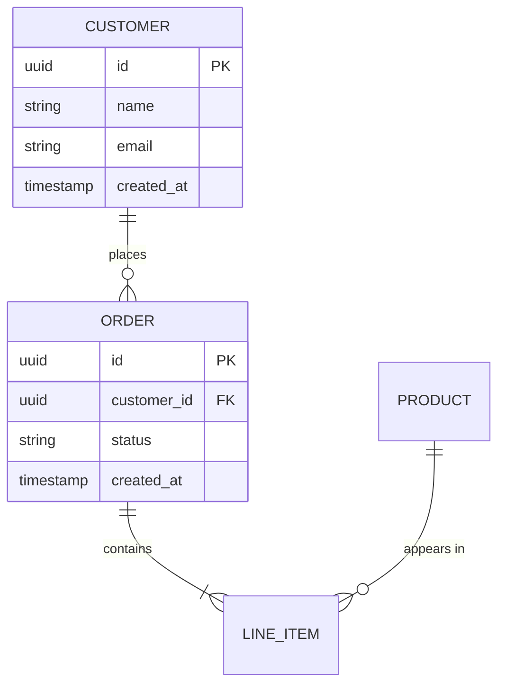

## Contract

```
sudo
Contracts {
  Inputs { codebase path, optional target language, optional output format (mermaid|markdown|json) }
  Outputs { entity list, relationships, Mermaid ERD, MODEL_REPORT.md }
  Constraints {
    MUST detect entities across TypeScript, Python, Go, Java, and other common languages
    SHOULD generate valid Mermaid ERD syntax
    SHOULD flag orphaned entities
    NEVER assume single language or single ORM
  }
}
```

## When to Use

- Extract entities/models from TypeScript, Python, Go, Java, etc.
- Generate Mermaid ERD from existing code
- Reverse-engineer database schemas from ORMs (Prisma, SQLAlchemy, GORM, etc.)
- Document data model architecture
- Find "missing" entities or orphaned models
- Map out database table relationships from legacy code
- Create API contract documentation from data models
- Onboard new developers to codebase data layer

## When NOT to Use

- Do NOT use for live database queries or runtime schema inspection
- Do NOT use for DDL generation or migration scripts
- Do NOT use for real-time schema synchronization
- Do NOT use when you need to modify existing schemas (only extracts, does not mutate)

## Critical Patterns

### Entity Detection Heuristics

```
CLASS/DENTITY + FIELDS         → Primary candidate
MODEL/TYPE/INTERFACE + FIELDS  → Primary candidate
STRUCT/TYPE ALIAS + FIELDS     → Primary candidate
DATABASE TABLE/SCHEMA DEF      → Primary candidate
ORM ANNOTATIONS (@, #, @Column)→ High confidence
```

### Confidence Scoring

| Pattern | Confidence |
|---------|------------|
| ORM decorator/annotation | HIGH |
| Class with typed fields | HIGH |
| Interface/type alias with fields | MEDIUM |
| Raw SQL table definition | HIGH |
| Function returning entity | LOW |
| Config object | LOW |

### Relationship Detection

```
 ForeignKey / @Column / relationship() / refs / join/
 ManyToMany / hasMany / belongsTo / oneToOne
```

## Workflow

```
1. SCAN  → ripgrep -t $LANG --files-with-matches "(class|interface|type|model|schema)" | head -50
           timing: ~5s for 1k files, ~30s for 10k files
           branches: if no results, try broader pattern or different language

2. PARSE → ripgrep -o -A 20 "(class|interface|type|model|schema)\s+(\w+)" --line-number
           extract field names + types per entity
           timing: ~10s for 100 entities, ~2min for 1k entities
           branches: TypeScript→interfaces, Python→SQLAlchemy classes, Go→structs

3. LINK  → ripgrep "(ForeignKey|@Column|@OneToMany|@ManyToOne|belongsTo|hasMany|references)" --line-number -o
           detect relationships between entities
           timing: ~5s for full codebase
           branches: Prisma schema vs ORM decorator vs raw FK

4. DRAW  → generate Mermaid ERD syntax from parsed data
           timing: ~1s for <100 entities, ~10s for <1k entities
           ensure PK/FK marked, relationships directional

5. VALIDATE → check completeness, flag orphaned entities, verify Mermaid renders
           timing: ~2s
           output: MODEL_REPORT.md with entity list + relations + ERD
```

## Mermaid ERD Output Format



## Entity Extraction Prompts

**Scan for TypeScript/JavaScript entities:**
```bash
rg -t ts -t tsx "(class|interface|type|model|schema)" --line-number -o | head -100
```

**Scan for Python entities:**
```bash
rg -t py "(class.*Model|class.*Table|Base| declarative)" --line-number -o
```

**Scan for Go entities:**
```bash
rg -t go "(type.*struct|type.*struct|type.*interface)" --line-number -o
```

**Scan for Prisma:**
```bash
rg "model\s+\w+\s*{" --type-add 'prisma:*.prisma' -t prisma --line-number -o
```

**Scan for SQLAlchemy:**
```bash
rg "class.*\(Base\)|Table\(|Column\(" --type py --line-number -o
```

## Relationship Extraction

```bash
# Find foreign keys and relationships
rg "(ForeignKey|@Column|@OneToMany|@ManyToOne|belongsTo|hasMany|references)" --line-number -o
```

## Full Mining Pipeline

```bash
# 1. Detect language/stack
rg "package\.json|cargo\.toml|go\.mod|requirements\.txt" -t none -o | head -5

# 2. Find entity files
rg -t $LANG "(class|interface|type|model|schema|entity)" --files-with-matches

# 3. Extract entities with fields
rg "(class|interface|type|model|schema)\s+(\w+)" --line-number -o -A 20

# 4. Find relationships
rg "(ForeignKey|@Column|@OneToMany|@ManyToOne|relation|references)" --line-number -o
```

## Output Artifacts

| Artifact | File | Format |
|----------|------|--------|
| Entity list | `data-model/entities.md` | Markdown table |
| Relationships | `data-model/relations.md` | Markdown table |
| Mermaid ERD | `data-model/model.mermaid` | Mermaid diagram |
| Full report | `data-model/MODEL_REPORT.md` | Markdown |

## Validation Checklist

- [ ] All detected entities are listed
- [ ] All fields have types
- [ ] Relationships have direction
- [ ] PK/FK are marked
- [ ] Orphan entities flagged
- [ ] Mermaid renders correctly

## Edge Cases

- **Multi-schema databases**: Run separately per schema, merge results
- **Microservices**: Each service may have its own model — scan all services
- **Legacy ORM patterns**: May need broader regex patterns (e.g., `class \w+` without Base)
- **No results found**: Try broader patterns, check language detection, verify files exist
- **Too many entities**: Prioritize by file count, focus on core domain entities first
- **Circular references**: Mermaid handles these but may need layout hints

## Commands

For detailed bash commands and pipeline scripts, see [refs/](../refs/)

```bash
# Quick entity scan
rg "(class|interface|type)\s+\w+" -t $LANG --files-with-matches | head -20

# Generate ERD from Prisma schema
cat schema.prisma | grep -A 50 "model\s" > entities.txt

# Count entities per file
rg "class\s+\w+" -t $LANG --line-number | cut -d: -f1 | sort | uniq -c | sort -rn
```

## Resources

- **Templates**: See [assets/](assets/) for entity extraction templates
- **Examples**: See [references/](references/) for existing model reports

## Companion Files

| Path | Purpose |
|------|---------|
| [refs/commands.md](refs/commands.md) | Detailed bash commands for entity extraction across languages |
| [tests/test_entity_detection.py](tests/test_entity_detection.py) | Characterization tests for entity detection accuracy |
