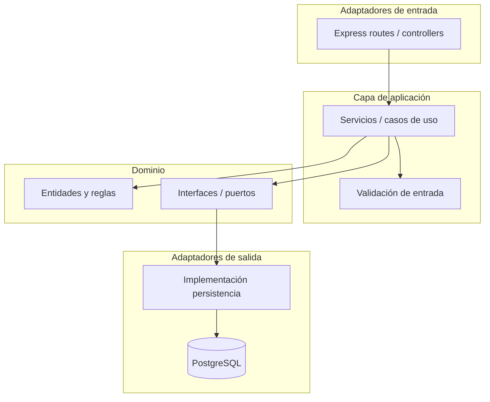

# Arquitectura del proyecto

Este documento describe la **arquitectura objetivo** del sistema (hexagonal / ports & adapters alineada con DDD) y cómo se **mapea** al repositorio actual. No convierte en “estándar oficial” los archivos que hoy incumplen esas reglas; esas desviaciones se citan solo como contexto de evolución.

## Objetivo arquitectónico

- **Dominio**: reglas de negocio, entidades y value objects **sin** dependencias de frameworks (Express, Multer) ni de infraestructura de persistencia concreta (p. ej. cliente Prisma).
- **Puertos**: interfaces que el dominio o la aplicación definen para colaboraciones externas (persistencia, reloj, notificaciones).
- **Adaptadores de entrada**: HTTP (Express), colas, CLI, etc. Traducen el transporte a llamadas a **casos de uso** o **servicios de aplicación**.
- **Adaptadores de salida**: implementaciones de puertos (p. ej. repositorios con Prisma).

## Mapeo a carpetas del backend (`backend/src/`)

| Objetivo | Carpeta en el repo | Rol esperado |
|----------|-------------------|--------------|
| Adaptador HTTP | `presentation/controllers/` | Controladores delgados: parseo mínimo de `Request`, códigos HTTP, delegación a la aplicación. |
| Casos de uso / orquestación | `application/services/` | Orquestar dominio y puertos; sin lógica de transporte ni detalles de ORM en lo posible. |
| Validación de entrada | `application/validator.ts` | Reglas de forma y consistencia de DTOs / payloads antes de tocar dominio. |
| Modelo de negocio | `domain/models/` | Entidades y comportamiento de negocio; en el **objetivo** no importan Prisma ni Express. |
| Definición de rutas | `routes/` | Registro de endpoints y enlace a controladores o handlers. |
| Composición | `index.ts` | Arranque del servidor, middleware global, registro de rutas. |

## Referencias “útiles” vs material a no tomar como guía

- **Útil como referencia de intención (no como cumplimiento estricto de hexagonal)**: separación física entre `application/`, `domain/`, `presentation/` y `routes/`; uso de `validator.ts` antes de persistir candidatos; controladores que delegan en funciones de aplicación para parte del flujo de candidatos.
- **No debe tomarse como patrón objetivo**: modelos en `domain/models/` que importan `@prisma/client`; servicios de aplicación acoplados a Express/Multer; uso extendido de `any`; lógica duplicada entre rutas y controladores; credenciales o URLs de base de datos fijadas en el esquema Prisma en lugar de variables de entorno.

## Calidad TypeScript (objetivo)

- Evitar `any` en APIs públicas; preferir interfaces/DTOs explícitos.
- Tipar retornos de funciones exportadas.
- Mantener interfaces de repositorio en dominio o aplicación y tipar implementaciones en infraestructura.

## Frontend (visión)

El cliente React debería consumir la API HTTP como **adaptador de entrada** del sistema completo: capas de UI, estado y cliente HTTP desacoplados de detalles del backend. El estado actual del árbol `frontend/src/` mezcla plantilla Create React App con componentes `.js`; la evolución recomendada es TypeScript estricto y límites claros por feature (ver `frontend.md`).
