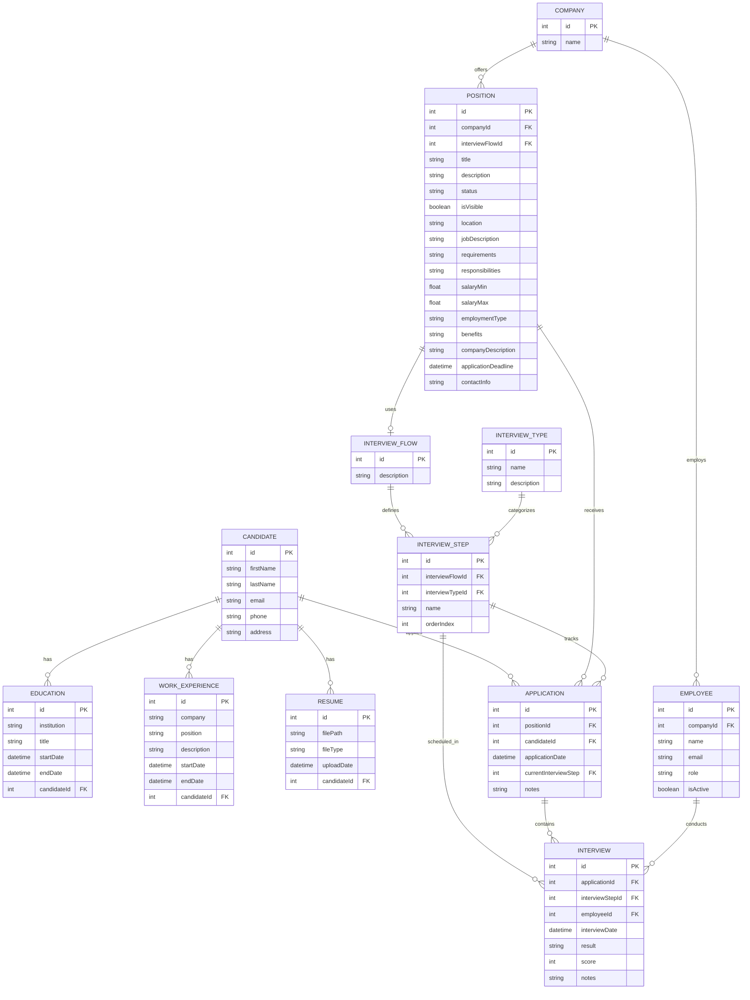

# Data Model

## Entity Relationship Diagram

## Entities

| Entity | Description | Fields |
|--------|-------------|--------|
| **Candidate** | Job applicant with personal info, education, work history | id, firstName, lastName, email, phone, address |
| **Education** | Candidate's educational background | id, institution, title, startDate, endDate, candidateId |
| **WorkExperience** | Candidate's work history | id, company, position, description, startDate, endDate, candidateId |
| **Resume** | Uploaded resume files | id, filePath, fileType, uploadDate, candidateId |
| **Company** | Hiring organization | id, name |
| **Employee** | Staff member of a company | id, companyId, name, email, role, isActive |
| **InterviewType** | Type/category of interview | id, name, description |
| **InterviewFlow** | Template defining interview stages | id, description |
| **InterviewStep** | Individual stage in an interview flow | id, interviewFlowId, interviewTypeId, name, orderIndex |
| **Position** | Job opening at a company | id, companyId, interviewFlowId, title, description, status, isVisible, location, jobDescription, requirements, responsibilities, salaryMin, salaryMax, employmentType, benefits, companyDescription, applicationDeadline, contactInfo |
| **Application** | Candidate's application to a position | id, positionId, candidateId, applicationDate, currentInterviewStep, notes |
| **Interview** | Scheduled interview instance | id, applicationId, interviewStepId, employeeId, interviewDate, result, score, notes |

## Relationships

| Relation | From | To | Type |
|----------|------|----|------|
| Candidate → Education | 1 | N | has |
| Candidate → WorkExperience | 1 | N | has |
| Candidate → Resume | 1 | N | has |
| Candidate → Application | 1 | N | applies |
| Company → Employee | 1 | N | employs |
| Company → Position | 1 | N | offers |
| Position → InterviewFlow | N | 1 | uses |
| InterviewFlow → InterviewStep | 1 | N | defines |
| InterviewType → InterviewStep | 1 | N | categorizes |
| InterviewStep → Application | 1 | N | tracks |
| InterviewStep → Interview | 1 | N | scheduled_in |
| Application → Interview | 1 | N | contains |
| Employee → Interview | 1 | N | conducts |

## Technology Stack

- **ORM**: Prisma
- **Database**: PostgreSQL
- **Language**: TypeScript (domain models)
