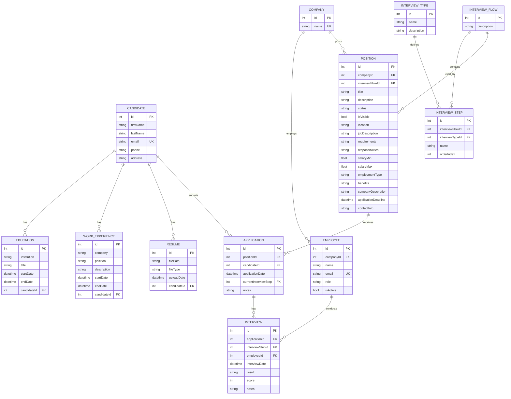

# Data Model

## System Overview

**System Name**: LTI - Talent Tracking System (Applicant Tracking System)  
**Database**: PostgreSQL  
**ORM**: Prisma  
**Database Name**: `LTIdb`

This document describes the data model for the LTI Applicant Tracking System, which manages the complete recruitment lifecycle from job posting to candidate selection.

---

## Actors / User Types

### Employee (Internal Users)

Internal system users who manage the recruitment process. Roles are stored as free-text strings (no enforced enum at database level).

- **Common Roles**: Recruiters, Hiring Managers, Interviewers, Administrators
- **Note**: Role-based access control is NOT enforced at database level

### Candidate (External Users)

External job applicants. No authentication system is implemented for candidates.

---

## Entity Analysis

### Candidate

Core entity representing job applicants.

| Field | Type | Description |
|-------|------|-------------|
| id | Int PK | Primary key, autoincrement |
| firstName | String NOT NULL | Candidate's first name (VARCHAR 100) |
| lastName | String NOT NULL | Candidate's last name (VARCHAR 100) |
| email | String UNIQUE NOT NULL | Candidate's email address (VARCHAR 255) |
| phone | String NULLABLE | Contact phone number (VARCHAR 15) |
| address | String NULLABLE | Physical address (VARCHAR 100) |

**Relationships**:
- A Candidate has zero or many Educations
- A Candidate has zero or many Work Experiences
- A Candidate has zero or many Resumes
- A Candidate submits zero or many Applications

**Design Decisions**:
- Email is unique to prevent duplicate candidate records
- Phone and address are optional as candidates may not provide them initially

---

### Education

Educational background of candidates.

| Field | Type | Description |
|-------|------|-------------|
| id | Int PK | Primary key, autoincrement |
| institution | String NOT NULL | Name of educational institution (VARCHAR 100) |
| title | String NOT NULL | Degree or certification title (VARCHAR 250) |
| startDate | DateTime NOT NULL | When education started (TIMESTAMP) |
| endDate | DateTime NULLABLE | When education ended (TIMESTAMP) |
| candidateId | Int FK | Reference to Candidate.id |

**Relationships**:
- An Education belongs to exactly one Candidate

**Design Decisions**:
- `endDate` is nullable for ongoing education

---

### WorkExperience

Professional experience of candidates.

| Field | Type | Description |
|-------|------|-------------|
| id | Int PK | Primary key, autoincrement |
| company | String NOT NULL | Company name (VARCHAR 100) |
| position | String NOT NULL | Job title/position (VARCHAR 100) |
| description | String NULLABLE | Role description (VARCHAR 200) |
| startDate | DateTime NOT NULL | When employment started (TIMESTAMP) |
| endDate | DateTime NULLABLE | When employment ended (TIMESTAMP) |
| candidateId | Int FK | Reference to Candidate.id |

**Relationships**:
- A WorkExperience belongs to exactly one Candidate

**Design Decisions**:
- `endDate` is nullable for current positions
- `description` is optional as not all roles require detailed descriptions

---

### Resume

CV/Resume files uploaded by candidates.

| Field | Type | Description |
|-------|------|-------------|
| id | Int PK | Primary key, autoincrement |
| filePath | String NOT NULL | Path to stored file (VARCHAR 500) |
| fileType | String NOT NULL | MIME type or extension (VARCHAR 50) |
| uploadDate | DateTime NOT NULL | When resume was uploaded (TIMESTAMP) |
| candidateId | Int FK | Reference to Candidate.id |

**Relationships**:
- A Resume belongs to exactly one Candidate

**Design Decisions**:
- Multiple resumes per candidate are allowed (e.g., updated versions)

---

### Company

Organizations posting job positions (multitenancy support).

| Field | Type | Description |
|-------|------|-------------|
| id | Int PK | Primary key, autoincrement |
| name | String UNIQUE NOT NULL | Company name (TEXT) |

**Relationships**:
- A Company employs zero or many Employees
- A Company posts zero or many Positions

**Design Decisions**:
- Company name is unique to prevent duplicate organizations
- This entity enables multitenancy isolation

---

### Employee

Internal users (recruiters, hiring managers, interviewers).

| Field | Type | Description |
|-------|------|-------------|
| id | Int PK | Primary key, autoincrement |
| companyId | Int FK | Reference to Company.id |
| name | String NOT NULL | Employee full name (TEXT) |
| email | String UNIQUE NOT NULL | Employee email (TEXT) |
| role | String NOT NULL | Role as free-text string (TEXT) |
| isActive | Boolean NOT NULL DEFAULT true | Active status flag |

**Relationships**:
- An Employee belongs to exactly one Company
- An Employee conducts zero or many Interviews

**Design Decisions**:
- Email is unique within the system
- `isActive` soft-delete pattern allows deactivating users without data loss
- Role is free-text for flexibility (no enforced enum)

---

### InterviewType

Types of interviews (e.g., Technical, Behavioral, Phone Screen).

| Field | Type | Description |
|-------|------|-------------|
| id | Int PK | Primary key, autoincrement |
| name | String NOT NULL | Interview type name (TEXT) |
| description | String NULLABLE | Type description (TEXT) |

**Relationships**:
- An InterviewType defines zero or many InterviewSteps

**Design Decisions**:
- Provides reusable interview type definitions across flows

---

### InterviewFlow

Predefined interview process templates.

| Field | Type | Description |
|-------|------|-------------|
| id | Int PK | Primary key, autoincrement |
| description | String NULLABLE | Flow description (TEXT) |

**Relationships**:
- An InterviewFlow contains zero or many InterviewSteps
- An InterviewFlow is used by zero or many Positions

**Design Decisions**:
- Enables standardized interview processes across positions

---

### InterviewStep

Individual steps within an interview flow.

| Field | Type | Description |
|-------|------|-------------|
| id | Int PK | Primary key, autoincrement |
| interviewFlowId | Int FK | Reference to InterviewFlow.id |
| interviewTypeId | Int FK | Reference to InterviewType.id |
| name | String NOT NULL | Step name (TEXT) |
| orderIndex | Int NOT NULL | Step order in flow |

**Relationships**:
- An InterviewStep belongs to exactly one InterviewFlow
- An InterviewStep belongs to exactly one InterviewType
- An InterviewStep is the current step for zero or many Applications
- An InterviewStep has zero or many Interviews

**Design Decisions**:
- `orderIndex` enables ordered steps within a flow
- Links both to flow (process) and type (category)

---

### Position

Job openings/positions being recruited for.

| Field | Type | Description |
|-------|------|-------------|
| id | Int PK | Primary key, autoincrement |
| companyId | Int FK | Reference to Company.id |
| interviewFlowId | Int FK | Reference to InterviewFlow.id |
| title | String NOT NULL | Position title (TEXT) |
| description | String NOT NULL | Short description (TEXT) |
| status | String NOT NULL DEFAULT 'Draft' | Position status (TEXT) |
| isVisible | Boolean NOT NULL DEFAULT false | Public visibility flag |
| location | String NOT NULL | Job location (TEXT) |
| jobDescription | String NOT NULL | Full job description (TEXT) |
| requirements | String NULLABLE | Required skills/qualifications (TEXT) |
| responsibilities | String NULLABLE | Job responsibilities (TEXT) |
| salaryMin | Float NULLABLE | Minimum salary (DOUBLE PRECISION) |
| salaryMax | Float NULLABLE | Maximum salary (DOUBLE PRECISION) |
| employmentType | String NULLABLE | Full-time, Part-time, etc. (TEXT) |
| benefits | String NULLABLE | Benefits information (TEXT) |
| companyDescription | String NULLABLE | About the company (TEXT) |
| applicationDeadline | DateTime NULLABLE | Last date to apply (TIMESTAMP) |
| contactInfo | String NULLABLE | Contact details (TEXT) |

**Relationships**:
- A Position belongs to exactly one Company
- A Position uses exactly one InterviewFlow
- A Position receives zero or many Applications

**Design Decisions**:
- Default status is 'Draft' for unpublished positions
- `isVisible` controls public listing separately from status
- Salary range is optional for flexibility

---

### Application

Candidate applications for specific positions.

| Field | Type | Description |
|-------|------|-------------|
| id | Int PK | Primary key, autoincrement |
| positionId | Int FK | Reference to Position.id |
| candidateId | Int FK | Reference to Candidate.id |
| applicationDate | DateTime NOT NULL | When application was submitted (TIMESTAMP) |
| currentInterviewStep | Int FK | Reference to InterviewStep.id (current stage) |
| notes | String NULLABLE | Internal notes (TEXT) |

**Relationships**:
- An Application belongs to exactly one Position
- An Application is submitted by exactly one Candidate
- An Application is at exactly one InterviewStep (current stage)
- An Application has zero or many Interviews

**Design Decisions**:
- `currentInterviewStep` tracks progression through the interview flow
- Junction table between Candidate and Position (many-to-many resolved)

---

### Interview

Scheduled/completed interviews.

| Field | Type | Description |
|-------|------|-------------|
| id | Int PK | Primary key, autoincrement |
| applicationId | Int FK | Reference to Application.id |
| interviewStepId | Int FK | Reference to InterviewStep.id |
| employeeId | Int FK | Reference to Employee.id (interviewer) |
| interviewDate | DateTime NOT NULL | When interview occurred (TIMESTAMP) |
| result | String NULLABLE | Interview outcome (TEXT) |
| score | Int NULLABLE | Numerical score (INT) |
| notes | String NULLABLE | Interviewer notes (TEXT) |

**Relationships**:
- An Interview belongs to exactly one Application
- An Interview is for exactly one InterviewStep
- An Interview is conducted by exactly one Employee

**Design Decisions**:
- `score` is nullable as not all interviews use numerical scoring
- `result` and `notes` are optional for flexibility

---

## Entity Relationship Diagram

---

## Summary Statistics

| Category | Count |
|----------|-------|
| Total Entities | 12 |
| Primary Keys | 12 (all Int, autoincrement) |
| Foreign Keys | 14 |
| Unique Constraints | 3 (Candidate.email, Company.name, Employee.email) |
| Nullable Fields | 20 |
| Boolean Fields | 2 (Employee.isActive, Position.isVisible) |
| DateTime Fields | 8 |
| Default Values | 3 |

---

## Cross-Cutting Concerns

### Multitenancy
- Implemented via `Company` entity
- All Positions and Employees are scoped to a Company
- Data isolation is enforced through `companyId` foreign keys

### RBAC
- Roles are stored as free-text strings in `Employee.role`
- No database-level enforcement
- Authorization logic is application-level only

### Audit Logging
- No dedicated audit log entity exists
- Timestamps are not tracked on entities (no `createdAt`/`updatedAt`)
- Consider adding audit trail for compliance requirements

### Event Publishing
- No outbox pattern or event table exists
- Event-driven features would require new infrastructure

---

## Design Notes

### Primary Key Strategy
All entities use autoincrementing integers instead of UUIDs. This is simpler but may limit distributed system capabilities.

### Timestamps
Most entities lack `createdAt` and `updatedAt` fields. Consider adding these for audit and debugging purposes.

### Soft Deletes
Only `Employee.isActive` implements soft delete. Other entities use hard deletes.

### Text Fields
Many fields use `TEXT` type without length constraints, providing flexibility but reducing schema documentation.
