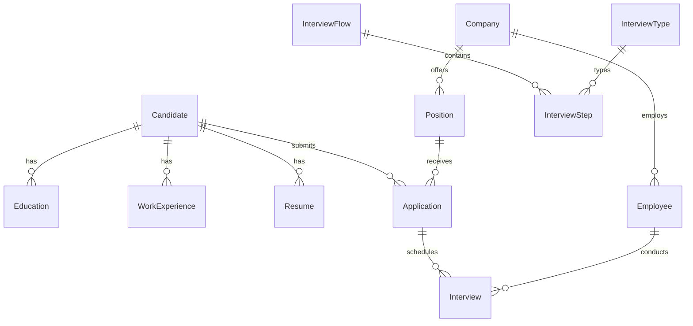

# Base de datos

Motor: **PostgreSQL**. Acceso desde el backend mediante **Prisma ORM**. Esquema y migraciones en `backend/prisma/`.

## Configuración (recomendación)

El `datasource` de Prisma debe resolver la URL de conexión desde el **entorno** (p. ej. `DATABASE_URL` en `.env`), no desde valores sensibles fijados en el repositorio. Cualquier URL con usuario y contraseña incrustados en `schema.prisma` es una **desviación de seguridad** y debe corregirse antes de considerarse práctica recomendada.

```prisma
# Patrón recomendado (ejemplo ilustrativo)
datasource db {
  provider = "postgresql"
  url      = env("DATABASE_URL")
}
```

## Modelos y relaciones (dominio persistido)

Resumen del modelo lógico según `backend/prisma/schema.prisma` (nombres y cardinalidades; tipos exactos en el fichero fuente).

### Candidatos y currículum

- **Candidate**: identificador, nombre, apellidos, email único, teléfono y dirección opcionales.
- **Education**, **WorkExperience**, **Resume**: pertenecen a un **Candidate** (relación muchos-a-uno hacia candidato).

### Organización y empleo

- **Company**: nombre único.
- **Employee**: pertenece a una **Company**; puede participar en **Interview**.
- **Position**: oferta ligada a **Company** y a un **InterviewFlow**; recibe **Application**.

### Proceso de entrevistas

- **InterviewType** y **InterviewFlow** estructuran el proceso mediante **InterviewStep** (orden, nombre, vínculos a flujo y tipo).
- **Application**: candidato postulado a una **Position**, con paso actual (**InterviewStep**) y fecha de aplicación.
- **Interview**: instancia concreta de entrevista para una **Application**, un **InterviewStep** y un **Employee**.

### Diagrama simplificado



## Migraciones y datos semilla

- **Migraciones**: `backend/prisma/migrations/` (SQL versionado + `migration_lock.toml`).
- **Seed**: `backend/prisma/seed.ts` para datos iniciales de desarrollo o demos.

## Comandos habituales (desde `backend/`)

| Comando | Propósito |
|---------|-----------|
| `npx prisma migrate dev` | Aplicar migraciones en desarrollo. |
| `npx prisma db seed` | Ejecutar seed (si está configurado en `package.json`). |
| `npx prisma studio` | Exploración visual de tablas. |

## Índices y restricciones destacables

- `Candidate.email` único (coherente con manejo de error de unicidad en la capa de aplicación).
- Restricciones de longitud en columnas (`@db.VarChar(...)`) alineadas con validaciones en `application/validator.ts` para parte del flujo de candidatos.
