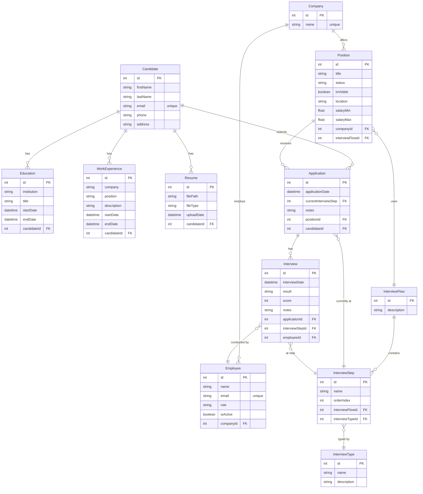

# Database

## Configuration

| Setting | Value |
|---------|-------|
| RDBMS | PostgreSQL |
| ORM | Prisma 5 |
| Schema file | `backend/prisma/schema.prisma` |
| Client target | `prisma-client-js` |

> The connection string is currently hardcoded in `schema.prisma`. It should be extracted to `DATABASE_URL` in `.env` using `url = env("DATABASE_URL")`.

---

## Models Overview

12 models covering the full recruitment workflow:

| Model | Purpose |
|-------|---------|
| `Candidate` | Applicant profile |
| `Education` | Candidate education history |
| `WorkExperience` | Candidate work history |
| `Resume` | Uploaded CV files |
| `Company` | Hiring organization |
| `Employee` | Recruiter / interviewer within a company |
| `Position` | Job opening |
| `InterviewFlow` | Reusable interview process template |
| `InterviewStep` | Ordered step within a flow |
| `InterviewType` | Category of interview (e.g., Technical, HR) |
| `Application` | Candidate application to a position |
| `Interview` | Individual interview session record |

---

## Model Definitions

### Candidate

| Field | Type | Constraints |
|-------|------|-------------|
| id | Int | PK, autoincrement |
| firstName | VarChar(100) | required |
| lastName | VarChar(100) | required |
| email | VarChar(255) | unique, required |
| phone | VarChar(15) | optional |
| address | VarChar(100) | optional |

Relations: `Education[]`, `WorkExperience[]`, `Resume[]`, `Application[]`

---

### Education

| Field | Type | Constraints |
|-------|------|-------------|
| id | Int | PK |
| institution | VarChar(100) | required |
| title | VarChar(250) | required |
| startDate | DateTime | required |
| endDate | DateTime | optional |
| candidateId | Int | FK → Candidate |

---

### WorkExperience

| Field | Type | Constraints |
|-------|------|-------------|
| id | Int | PK |
| company | VarChar(100) | required |
| position | VarChar(100) | required |
| description | VarChar(200) | optional |
| startDate | DateTime | required |
| endDate | DateTime | optional |
| candidateId | Int | FK → Candidate |

---

### Resume

| Field | Type | Constraints |
|-------|------|-------------|
| id | Int | PK |
| filePath | VarChar(500) | disk path |
| fileType | VarChar(50) | MIME type |
| uploadDate | DateTime | required |
| candidateId | Int | FK → Candidate |

---

### Company

| Field | Type | Constraints |
|-------|------|-------------|
| id | Int | PK |
| name | String | unique |

Relations: `Employee[]`, `Position[]`

---

### Employee

| Field | Type | Constraints |
|-------|------|-------------|
| id | Int | PK |
| name | String | required |
| email | String | unique |
| role | String | required |
| isActive | Boolean | default: true |
| companyId | Int | FK → Company |

Relations: `Interview[]`

---

### Position

| Field | Type | Constraints |
|-------|------|-------------|
| id | Int | PK |
| title | String | required |
| description | String | required |
| status | String | default: "Draft" |
| isVisible | Boolean | default: false |
| location | String | required |
| jobDescription | String | required |
| requirements | String | optional |
| responsibilities | String | optional |
| salaryMin | Float | optional |
| salaryMax | Float | optional |
| employmentType | String | optional |
| benefits | String | optional |
| companyDescription | String | optional |
| applicationDeadline | DateTime | optional |
| contactInfo | String | optional |
| companyId | Int | FK → Company |
| interviewFlowId | Int | FK → InterviewFlow |

---

### InterviewFlow

| Field | Type | Constraints |
|-------|------|-------------|
| id | Int | PK |
| description | String | optional |

Relations: `InterviewStep[]`, `Position[]`

---

### InterviewStep

| Field | Type | Constraints |
|-------|------|-------------|
| id | Int | PK |
| name | String | required |
| orderIndex | Int | determines step sequence |
| interviewFlowId | Int | FK → InterviewFlow |
| interviewTypeId | Int | FK → InterviewType |

Relations: `Application[]`, `Interview[]`

---

### InterviewType

| Field | Type | Constraints |
|-------|------|-------------|
| id | Int | PK |
| name | String | required |
| description | String | optional |

---

### Application

A candidate's application to a specific position, tracking which interview step they are currently at.

| Field | Type | Constraints |
|-------|------|-------------|
| id | Int | PK |
| applicationDate | DateTime | required |
| currentInterviewStep | Int | FK → InterviewStep |
| notes | String | optional |
| positionId | Int | FK → Position |
| candidateId | Int | FK → Candidate |

Relations: `Interview[]`

---

### Interview

One interview session within an application.

| Field | Type | Constraints |
|-------|------|-------------|
| id | Int | PK |
| interviewDate | DateTime | required |
| result | String | optional |
| score | Int | optional |
| notes | String | optional |
| applicationId | Int | FK → Application |
| interviewStepId | Int | FK → InterviewStep |
| employeeId | Int | FK → Employee |

---

## Entity-Relationship Diagram



---

## Schema Conventions

- All PKs: `Int @id @default(autoincrement())`
- String length constraints via `@db.VarChar(n)` — match validator rules
- Optional fields use `?` (nullable in Prisma, optional in TypeScript)
- Unique constraints: `@unique` on `email` fields, `Company.name`
- FK fields follow pattern: `[model]Id` (e.g., `candidateId`, `companyId`)

---

## Domain Model Mapping

Prisma models map 1:1 to TypeScript classes in `backend/src/domain/models/`. Field names are identical. The mapping currently happens in model constructors:

```typescript
// Candidate constructor accepts raw Prisma data shape
constructor(data: any) {
    this.firstName = data.firstName;
    this.email = data.email;
    // ...
}
```

---

## Migrations

```bash
# Create and apply a new migration (dev)
npx prisma migrate dev --name <description>

# Apply pending migrations (production)
npx prisma migrate deploy

# Regenerate Prisma Client after schema change (no migration)
npx prisma generate

# Open Prisma Studio (GUI browser for DB)
npx prisma studio
```

Migration files live in `backend/prisma/migrations/` — auto-generated, do not edit manually.
